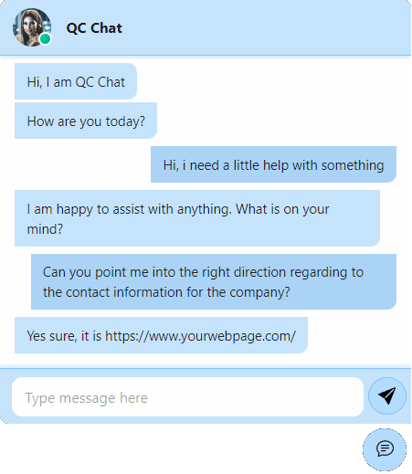

# Quick Chat API Client

[](https://github.com/entroped/quick-chat-api-client/actions/workflows/npm-build-test.yml)

A Simple React based chat component designed to use with external services via Rest APIs. 



Please note that this repository is under development. New updates are coming with the following:

 - External configuration (.env)
 - Message update from APIs
    - Waiting for long-time requests (Google Function -> OpenAI)
    - Message Polling (Rest API and Firebase)
 - Pub/Sub Support/Subscription

The current stage is considered a (UI/UX)/**POC Build**


## Getting started

```bash
npm install
npm run build
npm run start
```

You can find the main QuickChatComponent in ./src/components/[QuickChatComponent.tsx](src%2Fcomponents%2FQuickChatComponent.tsx)

## Contribute

There are many ways to [contribute](https://github.com/entroped/quick-chat-api-client/blob/main/CONTRIBUTING.md) to Quick Chat API Client.
* [Submit bugs](https://github.com/entroped/quick-chat-api-client/issues) and help us verify fixes as they are checked in.
* Review the [source code changes](https://github.com/entroped/quick-chat-api-client/pulls).
* [Contribute bug fixes](https://github.com/entroped/quick-chat-api-client/blob/main/CONTRIBUTING.md).

